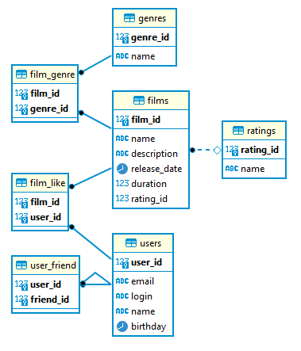

# Проект Filmorate

Технологии: Java 11, Spring Boot 2.7.2, PostgreSQL, Maven, Docker, JDBC, Lombok, Logbook.

## Описание

Filmorate - бэкенд для сервиса, который работает с фильмами и пользователями, также позволяет пользователям добавлять
друг друга в друзья, получать список общих друзей, ставить или удалять фильмам лайки и на основе оценок получать топ
фильмов, рекомендованных для просмотра.

Модель базы данных

## Запуск приложения

### С помощью командной строки

Необходимые инструменты:

* [Java (JDK) 11;](https://docs.aws.amazon.com/corretto/latest/corretto-11-ug/downloads-list.html)
* [Apache Maven 4.x](https://maven.apache.org/users/index.html)

Находясь в корневой папке проекта, выполнить:

* mvn package
* java -jar target/filmorate-0.0.1-SNAPSHOT.jar

### С помощью Docker

Необходимые инструменты:

* [Java (JDK) 11;](https://docs.aws.amazon.com/corretto/latest/corretto-11-ug/downloads-list.html)
* [Apache Maven 4.x](https://maven.apache.org/users/index.html)
* [Docker](https://www.docker.com/)

Находясь в корневой папке проекта, запустить Docker и выполнить:

* docker-compose up