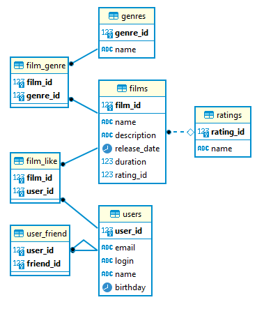

# Проект Filmorate

Технологии: Java 18, Spring Boot 3.4.5, JDBC, PostgreSQL, Maven, Docker, Lombok

---

## Описание

Filmorate - бэкенд для сервиса, который работает с фильмами и пользователями, также позволяет пользователям добавлять
друг друга в друзья, получать список общих друзей, ставить или удалять фильмам лайки и на основе оценок получать топ
фильмов, рекомендованных для просмотра. У фильма есть:

* Название
* Описание
* Дата выхода
* Продолжительность
* Возрастной рейтинг
* Набор жанров

У пользователя есть:

* Email
* Логин
* Имя
* Дата рождения

Возрастные рейтинги и жанры сохраняются в БД после запуска проекта.

---

## Endpoints

### Film

| Метод  | Путь                          | Описание                     |
|--------|-------------------------------|------------------------------|
| POST   | /films                        | Добавление фильма            | 
| PATCH  | /films                        | Обновление фильма            | 
| GET    | /films                        | Получение всех фильмов       | 
| GET    | /films/{filmId}               | Получение фильма по ID       | 
| POST   | /films/{filmId}/like/{userId} | Поставить лайк               | 
| DELETE | /films/{filmId}/like/{userId} | Удалить лайк                 | 
| GET    | /films/popular                | Получение популярных фильмов |

<details>
<summary>Пример тела запроса</summary>

```
{
    "name" : "string (required)",
    "description": "string",
    "releaseDate" : "string (format yyyy-MM-dd)",
    "duration" : number,
    "mpa" : {
        "id" : number (required),
        "name" : "string (required)"
    },
    "genres" : [
        {   
            "id" : number,
            "name" : "string"
        }
        ... more genres
    ]
}
```

</details>

### User

| Метод  | Путь                                     | Описание                      |
|--------|------------------------------------------|-------------------------------|
| POST   | /users                                   | Добавление пользователя       | 
| PATCH  | /users                                   | Обновление пользователя       | 
| GET    | /users                                   | Получение всех пользователей  | 
| GET    | /users/{userId}                          | Получение пользователя по ID  | 
| POST   | /users/{userId}/friends/{friendId}       | Добавление в друзья           | 
| DELETE | /users/{userId}/friends/{friendId}       | Удаление из друзей            | 
| GET    | /users/{userId}/friends                  | Получение списка друзей       |
| GET    | /users/{userId}/friends/common/{otherId} | Получение списка общих друзей |

<details>
<summary>Пример тела запроса</summary>

```
{
    "email" : "string (required, email format)",
    "login": "string (required)",
    "name" : "string",
    "birthday" : "string (format yyyy-MM-dd)"
}
```

</details>

### Rating

| Метод | Путь            | Описание                 |
|-------|-----------------|--------------------------|
| GET   | /mpa/{ratingId} | Получение рейтинга по ID | 
| GET   | /mpa            | Получение всех рейтингов | 

<details>
<summary>Список рейтингов</summary>

| Id | Название |
|----|----------|
| 1  | G        | 
| 2  | PG       |
| 3  | PG-13    | 
| 4  | R        |
| 5  | NC-17    | 

</details>

### Genre

| Метод | Путь              | Описание              |
|-------|-------------------|-----------------------|
| GET   | /genres/{genreId} | Получение жанра по ID | 
| GET   | /genres           | Получение всех жанров | 

<details>
<summary>Список жанров</summary>

| Id | Название       |
|----|----------------|
| 1  | Комедия        | 
| 2  | Драма          |
| 3  | Мультфильм     | 
| 4  | Триллер        |
| 5  | Документальный | 
| 6  | Боевик         | 

</details>

---

## Модель базы данных



---

## Запуск приложения

Необходимые инструменты:

* [Java (JDK) 18](https://github.com/corretto/corretto-18/releases)
* [PostgreSQL 15](https://www.enterprisedb.com/downloads/postgres-postgresql-downloads)

Создайте БД в PostgreSQL.
Настройте подключение к БД (через application.properties). Укажите:

- `spring.datasource.url`
- `spring.datasource.username`
- `spring.datasource.password`

---

### С помощью командной строки

Находясь в корневой папке проекта, выполнить:

Linux/macOS:

* ./mvnw package

Windows:

* mvnw.cmd package

После успешной сборки:

* java -jar target/filmorate-1.0.jar

---

### С помощью среды разработки (IntelliJ IDEA, Eclipse, NetBeans)

* Найдите `FilmorateApp` в src/main/java/filmorate/app
* Нажмите ▶️ рядом с классом (или Shift+F10 в IntelliJ IDEA)

---

### С помощью Docker

Необходимые инструменты:

* [Docker](https://www.docker.com/)

Находясь в корневой папке проекта, запустить Docker и выполнить:

* docker compose up --build